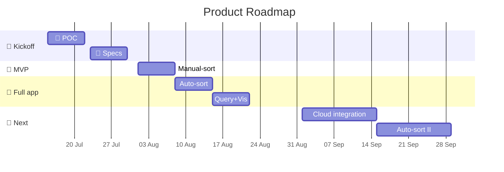
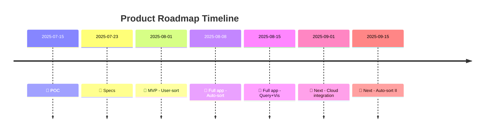

# Scope, split
## MVP#1
**usecases**
- can bookmark any pages using bookmarklet
- can copy/export data (to manually sort items in external tool like `Notion table`, or backup into private `Github Gists` )
- can paste/import data to restore/update data

-------------------------------------------------

## MVP#2
**usecases**
- can set sorting categories within the app
- can manually sort items within the app by editing item's sorting fields

**other feats**
- support for copying data as `JSON` or `CSV` format (`JSON` -> `CSV` conversion)
- support for pasting data from `JSON` or `CSV` format (`CSV` -> `JSON` conversion)

-------------------------------------------------

## APP v1
**usecases**
- can auto-sort items using AI external service
- can query data
- can visualize data

-------------------------------------------------

## APP v2

- advanced auto-sorting
- full integration with AI services and cloud
- sync

# 📆 Suggested Timeline

---

**Gantt chart** 

**Timeline**
